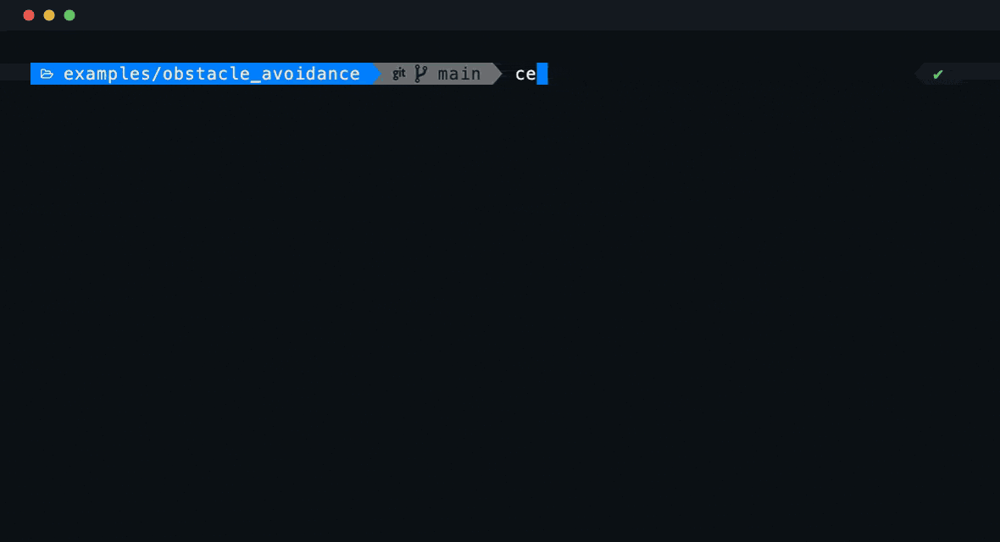
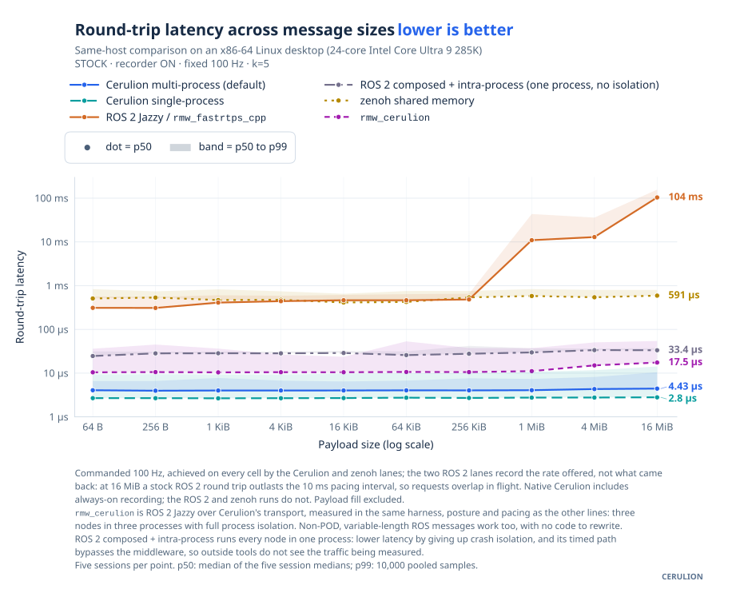
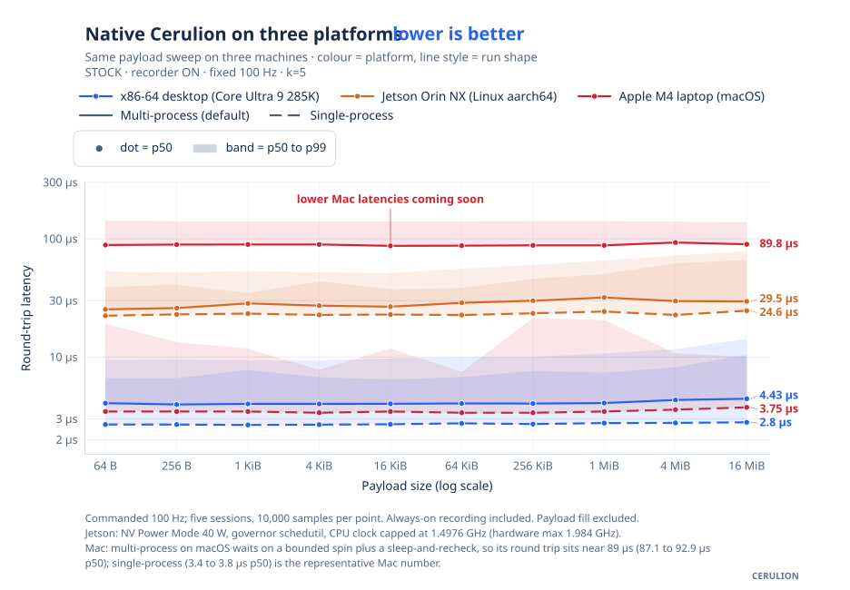
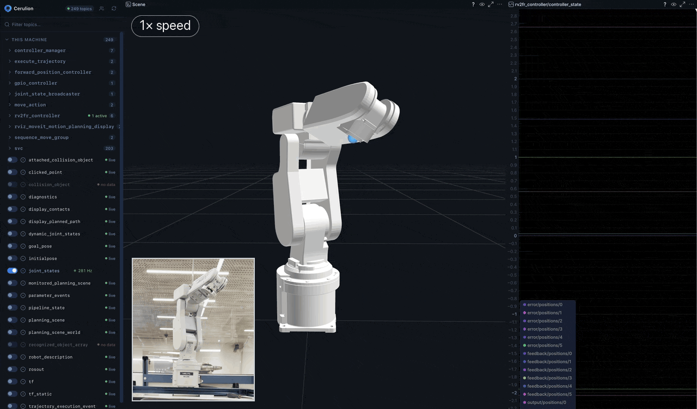

<p align="center">
  <a href="https://cerulion.com">
    <picture>
      <source media="(prefers-color-scheme: dark)" srcset="docs/media/cerulion-logo-dark.svg">
      <source media="(prefers-color-scheme: light)" srcset="docs/media/cerulion-logo-light.svg">
      
    </picture>
  </a>
</p>

**Run robots. Understand failures. Test every change.**

[](LICENSE)
[](https://crates.io/crates/cerulion_cli)
[](https://www.rust-lang.org/)
[](https://docs.cerulion.com)

Cerulion connects the software running on a robot to the tools that inspect it and the tests that keep it working. Run your nodes, see their data in Studio, capture a failure, and re-execute that recording against a code or model change before deploying it.

Built for **Physical AI**, Cerulion combines [iceoryx2](https://github.com/eclipse-iceoryx/iceoryx2) zero-copy shared memory, a scheduler that follows your node graph, ROS 2 interoperability and secure access to remote robots. The runtime records the data and execution context needed to turn real robot behavior into CI tests.

**[Install](#install) · [Architecture](#how-it-fits-together) · [Run the example](#quickstart-run-record-and-verify) · [Performance](#performance) · [ROS 2](#bring-your-ros-2-stack) · [Docs](https://docs.cerulion.com)**

<picture>
  <source media="(prefers-color-scheme: dark)" srcset="docs/media/development-loop-dark.svg">
  <source media="(prefers-color-scheme: light)" srcset="docs/media/development-loop-light.svg">
  
</picture>

## Why Cerulion

- **Zero-copy, beyond fixed-size messages.** Write camera frames, scans and schema-defined variable-length fields directly into shared memory. Other local processes read the same bytes.
- **A scheduler that knows your graph.** Dependency levels are computed ahead of time; trigger policies decide when nodes can run. Eligible nodes in the same level can run in parallel. Event-driven waits, reusable buffers and placement by measured cost reduce overhead; recorded scheduling and input decisions support deterministic replay.
- **Low latency, including the tail.** A 1 MiB native round trip measures 4.08 µs median and 7.38 µs p99 in the Linux multi-process benchmark, with recording enabled. [See the measurements and configurations](#performance).
- **Execution you can test.** Periodic, data-triggered, synchronized and external nodes; explicit backpressure and deadlines; recorded execution traces and a virtual clock for deterministic re-execution.
- **Recordings that become regression tests.** Standard MCAP, byte-exact output comparisons, per-field tolerances and machine-readable verdicts for CI. Test your changed code against the inputs that actually reached the robot.
- **Flashback when you forgot to record.** Save the moments before and after a failure from a rolling in-memory history, then inspect the incident or replay its recorded topics.
- **Studio for the whole robot.** Live sensors and 3D scenes, topic discovery, rates and graph inspection in a desktop workspace, with an agent beside the data.
- **Your robots, wherever they are.** Automatic account-based pairing connects owned and shared robots, with access grants controlling authenticated pub/sub. Discover nearby robots with mDNS; reach remote ones through Iroh hole punching or a relay.
- **A path from ROS 2.** Run an existing stack through `rmw_cerulion`, attach to one already running, or combine ROS 2 processes and native nodes in the same graph.
- **Tools your coding agent can use.** Cerulion MCP exposes graph, node, topic, recording and replay operations. Hindsight investigates recordings with evidence tied to topics and timestamps.
- **One workflow across machines.** Native single- and multi-process execution on Linux and macOS, with LAN topic delivery and remote data mirrored locally for your tools.

## Install

### CLI for robots and headless machines

```bash
curl -fsSL https://raw.githubusercontent.com/cerulion-inc/cerulion/main/tools/scripts/install.sh | sh
```

The installer puts the programs on the PATH of every new shell, so open a new terminal and sign in once with `cerulion login`: a robot or a headless box prints a short code to approve from any browser. It also installs the Rust compiler the release was built with.

**Homebrew**

```bash
brew tap cerulion-inc/cerulion
brew install cerulion-inc/cerulion/cerulion
```

Homebrew treats a third-party tap as untrusted until you install a fully qualified name, which is why the second line spells the formula out. On Homebrew 6.0.x the tap itself can refuse first; run `brew trust --formula cerulion-inc/cerulion/cerulion` before the two lines and try again.

**Debian / Ubuntu**

```bash
curl -fsSL https://d2tdat71jcoj6e.cloudfront.net/cerulion-archive-keyring.gpg | sudo tee /usr/share/keyrings/cerulion-archive-keyring.gpg >/dev/null
echo "deb [arch=$(dpkg --print-architecture) signed-by=/usr/share/keyrings/cerulion-archive-keyring.gpg] https://d2tdat71jcoj6e.cloudfront.net stable main" | sudo tee /etc/apt/sources.list.d/cerulion.list >/dev/null
sudo apt-get update && sudo apt-get install cerulion
```

Homebrew and the Debian package do not provision Rust. To build your own nodes, run `cerulion-install-rust` once and put `${CARGO_HOME:-$HOME/.cargo}/bin` on your PATH.

<details>
<summary>Build the CLI from crates.io</summary>

```bash
cargo install --locked cerulion_cli cerulion_netd
```

The release installer places `cerulion-connectd` beside the CLI for remote connections. See the [installation guide](https://docs.cerulion.com/cerulion/installation) or [CONTRIBUTING](.github/CONTRIBUTING.md) for the complete source-build route.

</details>

Release binaries support Linux x86_64 and ARM64 (glibc 2.35+) and macOS Intel and Apple Silicon. The Linux packages also carry the ROS 2 Jazzy rmw and heap hook that `cerulion ros2 run` and `cerulion ros2 launch` use; the macOS packages do not, because ROS 2 Jazzy has no macOS binaries.

Building nodes needs a C toolchain (`build-essential` on Debian and Ubuntu, `xcode-select --install` on macOS) and the **same compiler that built your `cerulion` binary**: a node is a shared library loaded into the CLI's own process, so the loader refuses a node built by a different rustc and names both compilers. The install script installs that compiler (Rust 1.93.0 for the 1.0.0 binaries), and `cerulion-install-rust` does on the other routes. A workspace created with `cerulion workspace create` or `cerulion workspace init` records it in its `rust-toolchain.toml` when that compiler is installed. Elsewhere, when your rustup default is a different compiler, name it: `RUSTUP_TOOLCHAIN=1.93.0 cerulion node build <node>`. The [installation details](docs/install.md) cover `CERULION_NO_MODIFY_PATH`, machines without rustup, `CARGO_HOME` and `RUSTUP_HOME`, hand-unpacked archives, workspaces without a `rust-toolchain.toml`, and a CLI built with `cargo install`.

### Studio for your computer

Use **Cerulion Studio** to discover robots, inspect their live data and work with an agent in one desktop app.

**[Download Studio for macOS](STUDIO_MACOS_DOWNLOAD_URL) · [Download Studio for Linux](STUDIO_LINUX_DOWNLOAD_URL)**

Studio bundles its visualization, network and workspace daemons; it does not install the CLI. Robots and headless machines use the CLI install above. Install it on your computer too if you want to build nodes or use Cerulion from a terminal.

## How it fits together

<picture>
  <source media="(prefers-color-scheme: dark)" srcset="docs/media/architecture-flow-dark.svg">
  <source media="(prefers-color-scheme: light)" srcset="docs/media/architecture-flow-light.svg">
  
</picture>

- **On the robot:** the scheduler derives dependency levels from your graph, waits on data and timers and executes ready nodes across process groups. Nodes exchange loaned shared-memory messages; capture records the data and execution context.
- **Across machines:** mDNS discovers nearby robots and LAN topics stream to your computer. Account ownership and grants authorize remote access over Iroh, using direct peer-to-peer connections when possible and a relay when needed. The network daemon mirrors subscribed topics locally for your tools.
- **At your desk:** Studio renders the robot's data; CLI and MCP tools inspect, record and verify it. Captured failures become inputs to the next regression test.

Guides: [Execution](https://docs.cerulion.com/cerulion/execution-order) · [Multi-process graphs](https://docs.cerulion.com/cerulion/guides/run-multi-process) · [Networking and remote robots](https://docs.cerulion.com/cerulion/guides/network-and-remote-robots) · [Remote access](docs/remote_plane.md)

## Quickstart: Run, record and verify

This example connects a synthetic laser scanner to a safety controller. The controller publishes a forward velocity of `0.3` when the path is clear and `0.0` when an obstacle is within half a meter.

```bash
git clone https://github.com/cerulion-inc/cerulion
```

```bash
cd cerulion/examples/obstacle_avoidance
```

Sign in once per machine. Cerulion commands run under an account, and the result is read locally from then on, so later commands keep working offline.

```bash
cerulion login
```

A robot or a headless box prints a short code to approve from a browser on any machine.

Build both nodes, check the graph, then run it with recording on. The first node build also compiles the Cerulion runtime, so it takes a few minutes on a laptop; later builds take seconds.

```bash
cerulion node build laser_scanner --release
cerulion node build safety_controller --release
cerulion graph validate obstacle_avoidance
cerulion graph run obstacle_avoidance --release --record
```

On the first run, Cerulion proposes one process per node and asks `Apply this partition to the graph file? [y/N]`. Press **Enter** to use that layout for this run, or **y** to save it in the graph YAML.

By default a run is visible to other machines on your network, so Studio and the CLI on another computer can find it; the log says so when the run starts. Add `--network off` to keep a run on this machine.

In a second terminal, watch the controller react:

```bash
cerulion topic echo /obstacle_avoidance/safety_controller/linear_velocity
```

The `x` field switches between `0.3` and `0.0` as the synthetic scan crosses the distance threshold. Let it run for at least five seconds, then stop it with **Ctrl+C**; Cerulion prints the completed recording's path, `recordings/obstacle_avoidance_<timestamp>.mcap`, where the timestamp reads like `20260918T181449Z`. To find the file again:

```bash
ls recordings/
```

Besides `recordings/`, the node builds leave `target/` in the example directory; a run leaves a `~/.cerulion/runs` directory and the `cerulion-netd` network daemon, which exits on its own after 30 seconds idle.

Set `BAG` to that printed path, then verify the unchanged code first:

```bash
BAG="recordings/obstacle_avoidance_<timestamp>.mcap"
cerulion bag play "$BAG" --resim all --verify
```

A successful verification prints `replay PASS` and exits successfully: the outputs covered by the report match the recording.

Now open `nodes/safety_controller/src/lib.rs` and change the clear-path velocity from `0.3` to `0.25`. Rebuild that node and verify against the **same recording**:

```bash
cerulion node build safety_controller --release
cerulion bag play "$BAG" --resim all --verify
```

This time verification reports a divergence and returns a nonzero exit code. On the same sensor inputs, the changed controller would command a different speed. In CI, that verdict flags the changed behavior for review before the code reaches a robot.



<details>
<summary>What replay verification checks</summary>

Cerulion re-executes the graph with recorded inputs and execution context, then compares the covered outputs against the recording. It checks behavior under those inputs; a passing result is not a claim about every environment the robot could encounter.

- Exit **0**: compared frames match.
- Exit **1**: output data diverged; the report names the topic or field.
- Exit **6**: the execution schedule diverged.
- Exits **2 through 5**: verification could not complete; the error identifies why.

Comparisons are byte-exact by default. Add `--tolerance` for acceptable per-field differences and `--report` for a machine-readable report.

</details>

Guides: [Quickstart](https://docs.cerulion.com/cerulion/quickstart) · [Record and replay](https://docs.cerulion.com/cerulion/guides/record-and-replay)

## Replay verification turns model changes into regression tests

The [perception example](examples/perception/) records a synthetic camera and pixel-based detector, verifies the baseline, then tests a detector whose boxes move by eight pixels. Its bounding-box overlap tolerance catches the change and names the affected field.

From the repository root:

```bash
cd examples/perception
```

```bash
RECORD_SECS=8 ./run_replay_demo.sh
```


Choose tolerances that match the behavior you care about: bounding-box IoU, absolute or relative error, RMSE and set comparisons. Comparisons are byte-exact unless you set a field, topic or document-wide tolerance. The same checks can run on pull requests against recordings your team keeps as regression cases.

## Performance

### Native graph round trips

Local shared-memory delivery stays nearly flat as payloads grow. These measurements include the native capture plane on the measured Linux x86_64 host.

Each cell below is **p50 / p99**, in microseconds: median latency and the threshold at or below which 99% of measured round trips fall. Both legs use the advertised payload size.

The native benchmark loans that payload without filling it. Timing starts after the publisher's loan and metadata setup and ends on echo receipt; the echo loans the same payload size and forwards the timestamp. Sensor production and payload processing add their own work.

| Payload | Cerulion multi-process (default), p50 / p99 in µs | Cerulion single-process, p50 / p99 in µs | ROS 2 Jazzy / `rmw_fastrtps_cpp` defaults, p50 / p99 in µs |
|---|---:|---:|---:|
| 64 B | 4.07 / 6.61 | 2.69 / 9.41 | 311 / 568 |
| 1 MiB | 4.08 / 7.38 | 2.76 / 10.74 | 10,952 / 43,402 |
| 16 MiB | 4.43 / 10.45 | 2.80 / 14.23 | 103,854 / 156,924 |



This workload comparison uses a nominal 100 Hz offered load. The stock ROS 2 lane pipelines requests: at 16 MiB a round trip outlasts the 10 ms pacing interval, so requests overlap in flight. Native Cerulion includes recording; the ROS 2 and zenoh lanes do not. The [benchmark suite](benches/latency/README.md) documents the process layouts and timing boundaries.

### ROS 2 over Cerulion

The `rmw_cerulion` line in the chart above is ROS 2 Jazzy running over Cerulion's transport, measured in the same harness, posture and pacing as every other line: three ROS 2 nodes in three processes, with loaned publishing and loaned subscription takes. At 1 MiB that is **11.12 µs p50 / 37.21 µs p99**, beside **11.0 ms / 43.4 ms** for stock `rmw_fastrtps_cpp`, the chart's own stock ROS 2 line. The median stays between 10.43 and 10.65 µs from 64 B to 256 KiB and reaches 17.47 µs at 16 MiB. [Methodology](benches/latency/METHODOLOGY.md) · [Results and provenance](docs/benchmarks/results/8a84baf25d5d1710-2026-09-18-fixed100-rmw-cerulion/).

### Across platforms



These native runs include recording. On the measured Apple M4, single-process medians are 3.38 to 3.75 µs; multi-process medians are 87 to 93 µs. A producer-driven macOS wake path is on the [roadmap](#roadmap).

Source measurements, build provenance and configuration receipts are in [the benchmark results](docs/benchmarks/results/). Lines show p50 and bands extend to p99; both figures show round trips.

## Bring your ROS 2 stack

**When you control startup**, keep your launch file and start it through Cerulion:

```bash
cerulion ros2 launch my_robot_bringup camera.launch.py
cerulion ros2 run my_robot_drivers imu_node
```

Both set up `rmw_cerulion` and run the ROS 2 command, one launch file or one executable at a time. Your nodes keep their ROS 2 APIs and executors. Neither rewrites your source: publishers that copy keep copying until you migrate them. The ros2 CLI graph tools (`ros2 topic list`, `ros2 topic echo`, rqt) do not see Cerulion topics yet, because the rmw's discovery is process-local; inspect them with `cerulion topic list` and `cerulion topic echo`, which read the shared-memory plane.

<details>
<summary>Optional: migrate C++ publishers to zero-copy loans</summary>

```bash
cerulion ros2 migrate --workspace ~/ros2_ws
cerulion ros2 migrate --workspace ~/ros2_ws --write
```

The first command previews which C++ publish sites can move to the loaned-message API; `--write` applies the rewrite. Publishing and subscribing with loans are separate choices; the [ROS 2 guide](https://docs.cerulion.com/cerulion/guides/bridge-ros2) covers both and what to expect from each.

</details>

**When the stack is already running**, attach to its DDS topics:

```bash
cerulion ros2 attach --iface <local-interface-IP>
```

Use the IP address of this computer's interface on the robot's LAN. Attach discovers the existing DDS stack and bridges its topics; it does not restart those nodes.

Use `ros2:` entries to launch ROS 2 processes beside native nodes in one graph. The [MoveIt 2 example](examples/moveit_hero/) shows an unmodified planning stack running over `rmw_cerulion`.

Guides: [Bridge ROS 2](https://docs.cerulion.com/cerulion/guides/bridge-ros2) · [Compatibility and configuration](docs/ros2_compatibility.md)

## Write the node, declare the behavior

A typed input, a typed output and a `tick` method define the quickstart's safety controller. The macro supplies the port plumbing; the graph declares the wiring and the runtime handles scheduling, transport, recording and observability. You do not configure an executor, register callbacks or write a spin loop.

```rust
use cerulion_core::prelude::*;
use native_ros2_messages::geometry_msgs::Vector3;
use native_ros2_messages::sensor_msgs::LaserScan;

#[cerulion_node]
#[derive(Default)]
struct SafetyControllerNode {
    #[input(trigger, depth = 1, expect_within_ms = 100)]
    scan: LaserScan,
    #[output(promise_within_ms = 100)]
    linear_velocity: Vector3,
}

#[cerulion_node_impl]
impl SafetyControllerNode {
    fn tick(&mut self) -> Result<(), NodeError> {
        let ranges = self.scan.ranges();
        let stop = ranges.is_empty()
            || ranges.iter().any(|&r| r.is_nan() || r < 0.5);
        self.linear_velocity.x = if stop { 0.0 } else { 0.3 };
        Ok(())
    }
}
```

Here, `#[input(trigger)]` runs the controller when a scan arrives. The port deadlines make timing expectations observable through miss counters, alongside delivery-failure counts.

Other nodes can run on synchronized input sets or external events. For a periodic node, use `#[cerulion_node(period_ms = 10)]` instead of a data trigger. Set queue depth and backpressure per input; for example, `backpressure = sample(3)` limits reads to one per 3 ms.

Fixed fields write directly into the shared-memory slot. Variable-length fields have loaned writers too: `self.image.data.fill_from(producer)?` lets a camera or generator fill the final buffer in place. An untouched output publishes nothing; if this node's `tick` returns an error, its outputs are discarded.

Guides: [Define a node](https://docs.cerulion.com/cerulion/guides/define-a-node) · [Wire a graph](https://docs.cerulion.com/cerulion/guides/wire-and-run-a-graph) · [Backpressure and deadlines](https://docs.cerulion.com/cerulion/guides/backpressure-and-deadlines)

## See the robot in Studio

Cerulion Studio brings your robot's sensors, topics, graph and agent into one workspace. It is built on [Rerun](https://rerun.io), the open-source viewer for multimodal data. Discover a robot, select its topics and inspect live images, scans, point clouds and scalar signals together. Topic rates and liveness show which parts of the graph are active.



The agent sidebar can inspect the view, take a screenshot and arrange the scene through Studio's viewer tools. Ask it to investigate a signal alongside the live data.

Rendering and decoding run on your development computer. The robot supplies the topics you subscribe to; it does not need to run a visualization node.

For a terminal view:

```bash
cerulion topic list
cerulion topic hz /obstacle_avoidance/laser_scanner/scan
cerulion topic echo /obstacle_avoidance/safety_controller/linear_velocity
```

Guides: [Studio](https://docs.cerulion.com/cerulion/guides/visualize-in-studio) · [Inspect topics](https://docs.cerulion.com/cerulion/guides/inspect-topics) · [Remote robots](https://docs.cerulion.com/cerulion/guides/network-and-remote-robots)

## Capture the failure with Flashback

A robot rarely fails on cue. Flashback keeps a memory-bounded window of recent activity in every running graph, so the moments before a problem are already there when you need them. It is event-based logging: nothing is written to disk until an event fires, and then the window around that event becomes a recording.

**It captures on its own** when the runtime sees a fault: a worker process dies, a node is disabled after repeated panics, the run it was bound to vanishes, the e-stop is engaged, a topic stalls while its process stays alive, or a topic's rate collapses inside the window. Each capture holds the retained history plus a short period after the trigger, written to MCAP. A capture on a route that never produced at all is the one trigger that ships off.

**You can also ask for one by hand** from another shell on the robot:

```bash
cerulion flashback --note "controller stopped late"
```

Re-execution uses the capture's execution trace and any state anchors its starting point needs; `bag info` reports whether a capture can be re-executed or only played back. To record an already-running graph instead, use `cerulion bag record --run=obstacle_avoidance`.

Guides: [Flashback](docs/flashback.md) · [Record and replay](https://docs.cerulion.com/cerulion/guides/record-and-replay) · [Bags and replay](docs/bag.md)

## Give your agent access to the robot

<details>
<summary>Cerulion MCP and Hindsight: tools for your coding agent</summary>

**Cerulion MCP** gives Claude Code, Codex and other MCP clients tools for graphs, nodes, topics, robots, recordings, Flashback and replay verification. An agent can inspect live data, rebuild a node and re-run a captured recording.

**Hindsight** investigates MCAP recordings with answers grounded in specific topics and timestamps.

Register the hosted endpoints with your client:

```bash
claude mcp add --transport http cerulion https://mcp.cerulion.com/mcp/cerulion
claude mcp add --transport http hindsight https://mcp.cerulion.com/mcp/hindsight
```

For screenshots and viewport control, use Studio's built-in agent. Cerulion MCP exposes runtime tools and does not include Studio's viewport tools.

Guide: [Connect an MCP client](https://docs.cerulion.com/cerulion/guides/connect-an-mcp-client)

</details>

## Roadmap

The direction is **CI/CD for autonomy**: bring recordings, simulations and behavioral evidence into the review process before a change reaches a robot.

| Area | What's next |
|---|---|
| **Faster execution** | Chain-fused nodes that pass data directly within a process; nanosecond-scale handoff as a measured target; lower macOS cross-process wake-up latency. |
| **Python and C++** | First-class node authoring and client libraries, with clear boundaries for zero-copy access, scheduling and reproducible execution. |
| **Robot building blocks** | Native transforms and URDF support, parameters and lifecycle, with a clear path from the corresponding ROS 2 concepts. |
| **Flashback from node code** | Declare an incident from a node's own code, so a bumper or a grasp check saves the moment it sees. |
| **Services and actions** | A native request/response API for node authors on the shipped deterministic service layer, then actions: long-running goals with feedback, cancellation and streaming replies. |
| **Pull-request verification** | A GitHub reviewer that runs recorded regressions and cloud simulations, reports behavioral differences and preserves the evidence with the change. |
| **Scenario libraries** | User-defined environments and expected behavior, prior failure bags promoted to regression cases, and generated stress scenarios with reviewable test expectations. |
| **Model and embodiment adapters** | Develop the Robot Context Protocol (RCP) with versioned robot capabilities, model interfaces, execution feedback and recorded outcomes so models can move between embodiments. |
| **Studio and agents** | A tighter loop for inspecting data, changing code and replaying results; agent-controlled views and comparison of live runs, recordings and verification reports. |
| **Platforms and interoperability** | Windows support, broader hardware validation and easier exchange with existing robotics data tools. |
| **Remote access** | Hardening the account-based pairing and remote access layer: robot-side provisioning, hosted account services and grant management across owned and shared robots. |

The roadmap is open for use cases and contributions: [discuss a feature](https://github.com/cerulion-inc/cerulion/issues). Release changes are recorded in the [changelog](CHANGELOG.md).

## Examples

| Example | What it demonstrates |
|---|---|
| [Obstacle avoidance](examples/obstacle_avoidance/) | Typed nodes, a live controller and replay verification. |
| [Camera pipeline](examples/camera_pipeline/) | In-place image generation and a data-triggered detector. |
| [Perception regression](examples/perception/) | Image-derived detections and a repeatable tolerance failure. |
| [V4L2 camera](examples/v4l2_camera/) | A Linux camera driver node watching a device fd, and a data-triggered brightness meter. Needs a camera. |
| [RealSense](examples/realsense/) | Color and depth from librealsense2 through a blocking SDK wait, and a nearest-obstacle range. Needs a RealSense. |
| [MoveIt 2](examples/moveit_hero/) | An existing ROS 2 planning stack using `rmw_cerulion`. |
| [Go2 quadruped](examples/go2/) | A DDS robot bridged, its camera transcoded, and a teleop stack with a safety mux and a sport driver. |

## Documentation and contributing

[Documentation](https://docs.cerulion.com) · [API reference](docs/user-api.md) · [Contributing](.github/CONTRIBUTING.md) · [Issues](https://github.com/cerulion-inc/cerulion/issues) · [Code of conduct](.github/CODE_OF_CONDUCT.md)

Report vulnerabilities through the [security policy](.github/SECURITY.md). Cerulion is built by [Cerulion Inc.](https://cerulion.com), a YC company. Commercial questions: licensing@cerulion.com.

## License

[AGPL-3.0-only](LICENSE), with a [commercial license](docs/legal/COMMERCIAL.md) available. The client-side `cerulion_wire`, `cerulion_link` and `cerulion_pairing` crates are MIT OR Apache-2.0; each manifest states its license.

## Citing Cerulion

Use GitHub's **Cite this repository** button or [CITATION.cff](CITATION.cff):

```bibtex
@software{cerulion,
  author  = {Sharma, Lakshay and Kariyawasam, Raveen and {Cerulion Inc. and contributors}},
  title   = {Cerulion: a robot runtime with byte-exact re-execution of recorded runs},
  year    = {2026},
  version = {1.0.0},
  url     = {https://github.com/cerulion-inc/cerulion}
}
```
